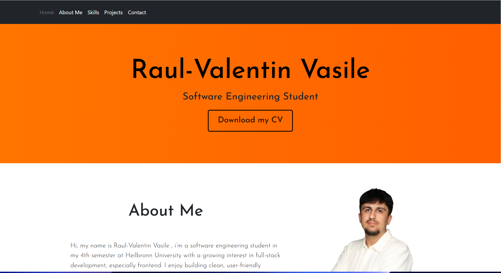
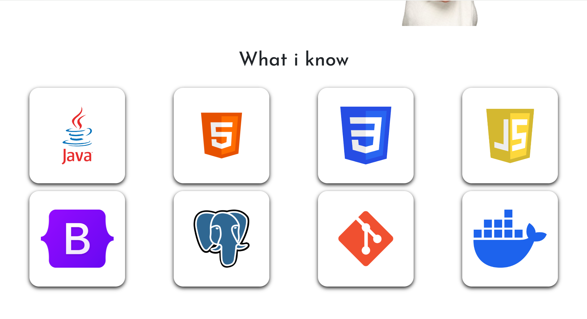
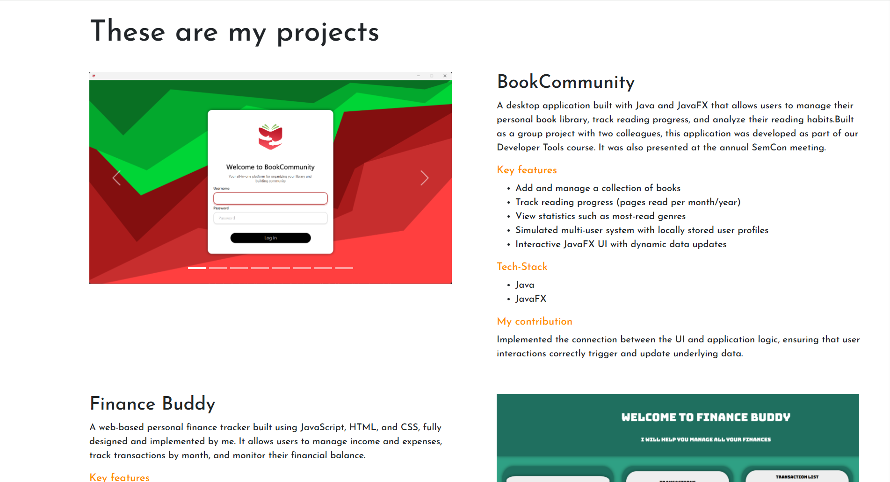
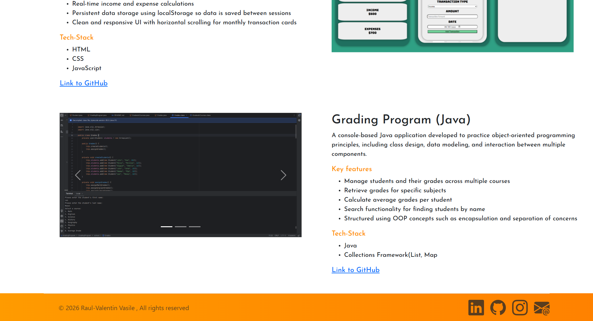

# Personal Portfolio Website

## Description
This is my personal portfolio website, built to showcase my projects, technical skills, and experience as a software engineering student.

## 🌐 Live Demo

(https://raulvasile04.github.io/Portfolio/)

## 📸Preview

## 🚀Features

- Responsive design for desktop and mobile devices
- Project showcase with descriptions and screenshots
- Skills section highlighting technologies and tools
- Contact section with links to GitHub, LinkedIn, Instagram and E-Mail
- Clean and modern UI design

## 🛠️Tech Stack
- HTML
- CSS
- Bootstrap

## 💡 Purpose

This project was built to improve my frontend development skills, including responsive design, 
layout structuring, and UI design. It also serves as a central place to present my projects and track my progress as a developer.

## 👨‍💻 Author

Raul-Valentin Vasile  
[GitHub](https://github.com/raulvasile04)  
[LinkedIn](https://linkedin.com/in/raul-valentin-vasile)

